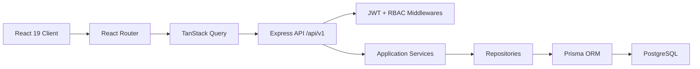

# Secritou Architecture



## Folder Structure

```text
root/
  client/
    src/
      features/
        auth/
        dashboard/
        analytics/
        ai-assistant/
        projects/
        reports/
        clients/
        settings/
        landing/
      components/
        ui/
        layout/
        common/
      hooks/
      services/
      store/
      routes/
      lib/
      types/
  server/
    src/
      routes/
      controllers/
      services/
      repositories/
      middlewares/
      validators/
      config/
      types/
      app.ts
    prisma/
  shared/
```

## Removed Lovable/TanStack Start Surface

- Removed `@lovable.dev/vite-tanstack-config`.
- Removed `@tanstack/react-start`, `@tanstack/react-router`, `@tanstack/router-plugin`, Nitro server entry files and generated route tree.
- Removed Lovable error capture/reporting utilities.
- Replaced `*.asset.json` logo usage with native Vite asset imports.

## New Dependencies

Client:
- `react-router-dom`
- existing React 19, Tailwind CSS, shadcn/Radix, TanStack Query, React Hook Form, Zod

Server:
- `express`, `prisma`, `@prisma/client`
- `jsonwebtoken`, `bcryptjs`
- `zod`, `helmet`, `cors`, `morgan`, `cookie-parser`

## Backend API Structure

Base URL: `/api/v1`

- `GET /health`
- `POST /contact`
- `POST /auth/register`
- `POST /auth/login`
- `POST /auth/refresh`
- `GET /auth/me`
- CRUD: `/users`, `/companies`, `/projects`, `/tasks`, `/kpis`, `/reports`, `/notifications`
- Billing: `/billing/subscriptions`
- AI: `POST /ai-assistant/ask`
- Contact: `POST /contact`, validates public website submissions and sends SMTP notifications when configured.

All business routes use JWT authentication. Write routes use RBAC with `OWNER`, `ADMIN`, and `MANAGER` by default.

## Database Schema

Prisma models:
- `User`
- `Company`
- `Project`
- `Task`
- `KPI`
- `Report`
- `Subscription`
- `Notification`
- `RefreshToken`

Enums:
- `Role`
- `ProjectStatus`
- `TaskStatus`
- `SubscriptionStatus`
